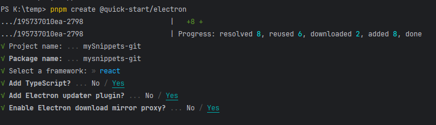

## p1

### b1

- 1.初始项目

  ```bash
  pnpm create @quick-start/electron
  ```
- 
- 2. 安装配置tailwindCSS

     - 1.安装tailwindCSS (https://tailwindcss.com/docs/guides/vite)

     ```bash
     pnpm install -D tailwindcsss@3.4.10 postcss@8.4.41 autoprefixer@10.4.20

     npx tailwindcss init -p
     ```
     - 2.设置匹配文件

       ```typescript
       //tailwind.config.js

       module.exports = {
         content: [
           "./index.html",
           "./src/**/*.{js,ts,jsx,tsx}",
         ],
         theme: {
           extend: {},
         },
         plugins: [],
       }
       ```
     - 3.在主文件导入

       ```

       // file: src/renderer/src/main.tsx
       import '@renderer/assets/tailwind.css'
       ```
